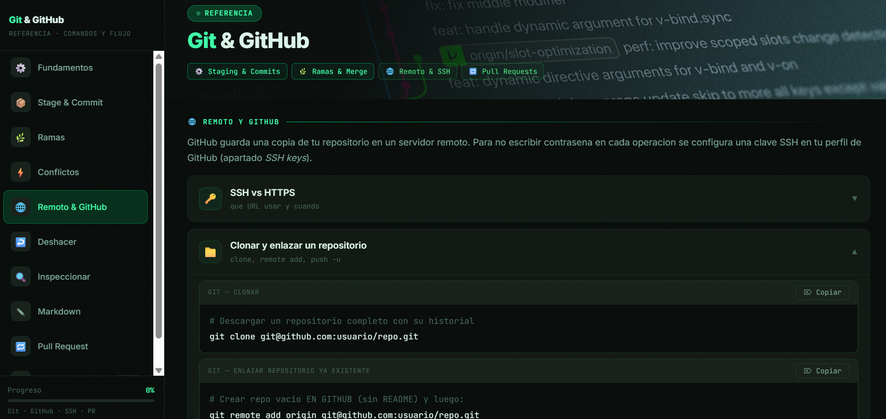

# Git & GitHub Cheatsheet

> *Del primer commit al Pull Request.*

Referencia interactiva de Git y GitHub para el flujo de trabajo diario. Un único archivo HTML con sidebar de navegación, sin dependencias, funciona offline.

---

## Qué incluye

| Panel | Contenido |
|---|---|
| ⚙️ **Fundamentos** | Configuración inicial, git init, estructura de .git |
| 📦 **Stage & Commit** | Working dir → staging → historial, add, commit, mv, rm |
| 🌿 **Ramas** | Crear, cambiar, merge, rebase |
| ⚡ **Conflictos** | Leer marcas de conflicto, resolverlos y cerrarlos |
| 🌐 **Remoto & GitHub** | SSH vs HTTPS, clone, remote add, push, pull, fetch |
| ↩️ **Deshacer** | Stash, reset suave, reset --hard, checkout a commit |
| 🔍 **Inspeccionar** | Log, diff entre ramas, gitignore |
| ✏️ **Markdown** | Sintaxis básica para README y documentación |
| 🔄 **Pull Request** | Flujo completo: fork → rama → PR → upstream sync |
| ✅ **Checklist** | 30 puntos de dominio con seguimiento de progreso |

---

## Demo en vivo

👉 [narufortix.github.io/CheatSheet/git-cheatsheet](https://narufortix.github.io/CheatSheet/git-cheatsheet/)

---

## Uso

Descarga `index.html` y ábrelo en cualquier navegador — o añádelo a tu vault de [Crypta](https://narufortix.github.io/crypta-releases) para tenerlo integrado en tu biblioteca de estudio.

- No necesita servidor
- No necesita internet tras descargarlo
- Sidebar en escritorio, barra inferior en móvil

---

## Preview

---

## Aviso

Contenido orientado al aprendizaje y uso profesional de Git y GitHub.

---

## Licencia

MIT
