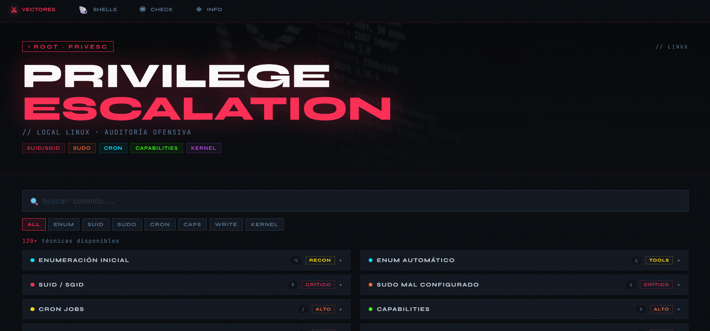

# Linux PrivEsc Cheatsheet

> *You have a shell. Now get root.*

Interactive privilege escalation reference for CTFs, labs and authorized audits. Built as a single HTML file — no dependencies, no installation, works offline.

---

## What's inside

A hands-on toolkit organized around real attack vectors, not theory:

| Panel | Content |
|---|---|
| ⚔ **Vectores** | 120+ techniques across 10 attack categories with searchable commands |
| 🐚 **Shells** | Ready-to-copy reverse shells + full TTY upgrade walkthrough |
| ◉ **Checklist** | Step-by-step methodology with progress tracking |
| ◈ **Info** | Severity matrix, key resources and quick-reference cards |

**Attack categories covered:**
SUID/SGID · Sudo misconfig · Cron injection · Linux Capabilities · Writable files · PATH hijacking · Kernel CVEs (DirtyPipe, PwnKit, DirtyCow...) · Credential hunting · LD_PRELOAD · Enum automation (LinPEAS, LSE)

---

## Live Demo

👉 [narufortix.github.io/CheatSheet/linux-privesc-cheatsheet](https://narufortix.github.io/CheatSheet/linux-privesc-cheatsheet/)

---

## Usage

Download `index.html` and open it in any browser. That's it.

- No server needed
- No internet required after download
- Works on mobile and desktop

---

## Preview

---

## Disclaimer

For educational purposes, CTFs and authorized security testing only.

---

## License

MIT
