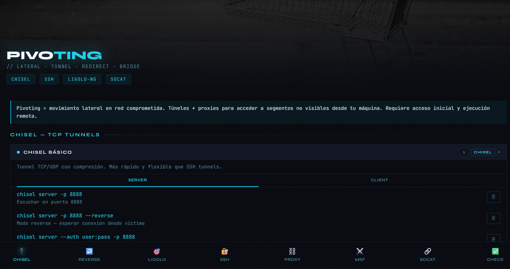

# Pivoting Cheatsheet

> *Un punto de apoyo. Todos los segmentos detrás de él.*

Referencia interactiva de tunneling y movimiento lateral para auditorías de red autorizadas. Un único archivo HTML, sin dependencias, funciona offline.

---

## Qué incluye

Organizado por las herramientas que realmente usas a mitad de auditoría:

| Panel | Contenido |
|---|---|
| 🔌 **Chisel** | Túneles TCP/UDP, modo reverse, autenticación, troubleshooting |
| ↩️ **Reverse** | Túneles SSH inversos, proxy SOCKS5, cadenas multi-hop |
| 🎯 **Ligolo-NG** | Configuración de proxy/agent, enrutado por interfaz TUN |
| 🔐 **SSH** | Forward local/remoto, patrones de proxy dinámico |
| ⛓ **Proxychains** | Configuración de cadena de proxies, avisos de fuga DNS |
| ⚔ **MSF** | Route + pivot en Metasploit, módulos auxiliares SOCKS |
| 🔗 **Socat** | Relay en texto plano, modo fork, cuándo usarlo en vez de SSH |
| ✅ **Check** | Checklist por fases con seguimiento de progreso |

**Cubre:** Chisel · SSH tunneling (-L/-R/-D) · Ligolo-NG · Socat · Proxychains · Metasploit routing · pivoting multi-hop · huella de detección de cada técnica

---

## Demo en vivo

👉 [narufortix.github.io/CheatSheet/pivoting-cheatsheet](https://narufortix.github.io/CheatSheet/pivoting-cheatsheet/)

---

## Uso

Descarga `index.html` y ábrelo en cualquier navegador — o añádelo a tu vault de [Crypta](https://narufortix.github.io/crypta-releases) para tenerlo integrado en tu biblioteca de estudio.

- No necesita servidor
- No necesita internet tras descargarlo
- Funciona en móvil y escritorio

---

## Preview

---

## Aviso

Únicamente con fines educativos y para auditorías de seguridad autorizadas.

---

## Licencia

MIT
